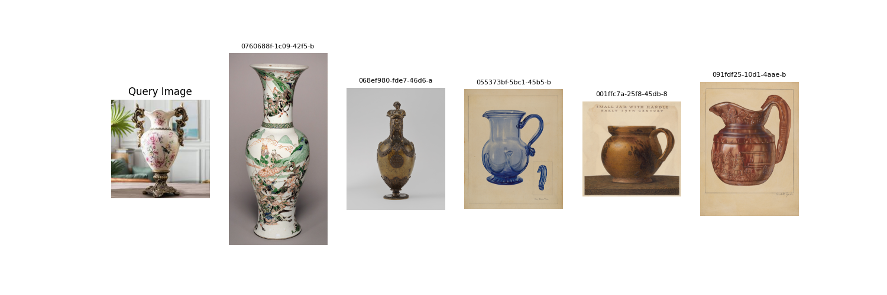
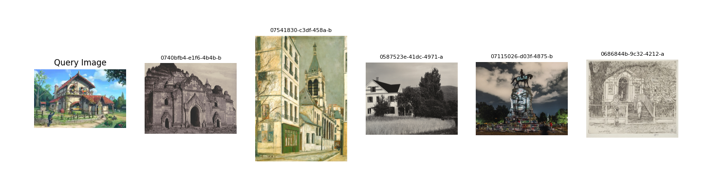

# NGA Similarity Model — GSOC 2025

> A project under Google Summer of Code 2025 focused on finding **similar artworks** (like portraits with similar faces or poses) using visual feature extraction from the **National Gallery of Art** open dataset.

---

## Task 2: Similarity Detection in Artworks

### **Objective:**  
Develop a model that takes an image as input and returns the **top-k visually similar paintings** from a dataset of thousands of artworks. The focus is on portraits with **similar facial features or poses**.

### **Dataset Source:**  
🔗 [National Gallery of Art Open Data](https://github.com/NationalGalleryOfArt/opendata)

## RESULTS AND APP INTERFACE (using streamlit)

<div align="center"> </div>

---

<div align="center"> </div>

---


<div align="center"> </div>

---


<div align="center"> </div>

---


<div align="center"> </div>

## 📦 Dataset Overview

- **Total Images Used**: ~2,700 paintings (after filtering for portraits and valid image files)
- **Format**: JPEG, PNG
- **Size**: 4.8 GB


---

## ⚙️ Approach & Methodology

### Feature Extraction

We use a **ResNet50** model pretrained on **ImageNet Weights** to extract high-level visual features from the paintings.

```python
model = torchvision.models.resnet50(pretrained=True)
model = torch.nn.Sequential(*list(model.children())[:-1])  # Remove final classifier
```

Each image is transformed into a 2048-dimensional feature vector.

🚀 How to Run
1. Clone this Repo

```bash
git clone https://github.com/YourUsername/nga-similarity.git
cd nga-similarity
```

2. Setup Environment

```python
conda env create -f env.yml
```

3. Query Image Search

```python 
python test_model_query.py  
```

4. Launch the UI

```bash
streamlit run app.py
```

## Model Architecture

```bash
[Input Image]
      ↓
[Pretrained ResNet50]
      ↓
[2048D Feature Vector]
      ↓
[Cosine Similarity Search]
      ↓
[Top-k Similar Images]
```

## Future Work

- Integrate facial landmark models for better pose matching

- Add semantic filtering (e.g., match only within same genre or artist)

-    Speed up with FAISS for large-scale similarity search

